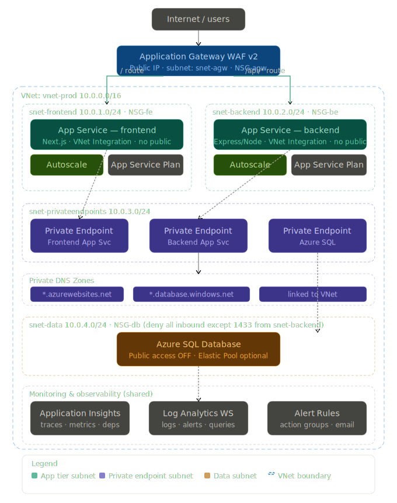

# 🕰️ Chronos — Haute Horlogerie E-Commerce Platform

> A production-grade **three-tier web application** migrated from a single on-premises VM to a fully scalable, secure **Microsoft Azure** infrastructure.


---

## 📌 Project Overview

**Chronos** is a luxury watch e-commerce platform. The core objective of this project is a real-world **cloud migration** — moving a legacy monolithic application from a single on-premises VM into a modern, secure, three-tier architecture on **Microsoft Azure**.

The application is fully containerized with Docker for local development and deployed to Azure App Service in production, with the database isolated behind a Private Endpoint inside a Virtual Network.

---

## 🏗️ Azure Architecture



| Component | Azure Resource | Subnet |
|-----------|---------------|--------|
| Traffic Entry | Application Gateway WAF v2 | `snet-agw` |
| Frontend | App Service `wa-frontend-ecom` | `snet-frontend` |
| Backend | App Service `wa-backend-ecom` | `snet-backend` |
| Database | Azure SQL Server (Private Endpoint) | `snet-privateendpoints` |
| Monitoring | Azure Monitor + Log Analytics | — |
| Security | NSG per subnet | All subnets |

**VNet:** `vnet-prod-west` — Region: `westus2` — Address space: `10.0.0.0/16`

---

## 🛠️ Tech Stack

| Layer | Technology | Details |
|-------|-----------|---------|
| Frontend | React 18 + TypeScript | Served via Nginx, custom Chronos luxury theme |
| Backend | Node.js + Express | REST API, JWT authentication |
| Database | Microsoft SQL Server 2022 | Azure SQL via Private Endpoint |
| Containers | Docker + Docker Compose | Multi-stage builds |
| Cloud | Microsoft Azure | App Service, VNet, NSG, Private DNS, App Gateway |

---

## ✅ Completed

### 🐳 Local Environment
- [x] SQL Server 2022 container with persistent volume
- [x] Node.js backend connected to SQL Server
- [x] `ecommercedb` database initialized with seed data
- [x] React frontend fully built — Chronos luxury dark theme
- [x] All pages complete: `Home`, `Products`, `ProductDetail`, `Cart`, `Orders`, `Login`, `Register`, `Profile`
- [x] Docker Compose orchestration with health checks and dependency ordering

### ☁️ Azure Infrastructure
- [x] Resource Group: `rg-ecommerce-prod`
- [x] Virtual Network: `vnet-prod-west` (westus2, `10.0.0.0/16`)
- [x] Subnets: `snet-agw`, `snet-frontend`, `snet-backend`, `snet-privateendpoints`, `snet-data`
- [x] NSGs: `nsg-agw-west`, `nsg-apps-west`, `nsg-db-west` — attached to all subnets
- [x] Azure SQL Server (`marcy`) with Private Endpoint + Private DNS Zone
- [x] App Service Plans + Web Apps: `wa-frontend-ecom`, `wa-backend-ecom` (westus2)

---

## 🔲 TODO — Azure Deployment

- [ ] VNet Integration — attach `wa-backend-ecom` to `snet-backend`
- [ ] VNet Integration — attach `wa-frontend-ecom` to `snet-frontend`
- [ ] Configure backend App Service environment variables (Azure SQL connection string)
- [ ] Deploy frontend Docker image to `wa-frontend-ecom`
- [ ] Deploy backend Docker image to `wa-backend-ecom`
- [ ] Create and configure Application Gateway WAF v2
- [ ] Configure routing: AGW → Frontend → Backend → SQL
- [ ] End-to-end smoke test via Azure public URL

---

## 🚀 Run Locally

### Prerequisites
- [Docker](https://docs.docker.com/get-docker/) & Docker Compose
- [Azure CLI](https://learn.microsoft.com/en-us/cli/azure/install-azure-cli) *(for cloud steps)*

### Quickstart
```bash
# 1. Clone the repository
git clone https://github.com/turkanismayilzad/Devops-Project1.git
cd Devops-Project1

# 2. Start all containers
docker compose up --build -d

# 3. First time only — create the database
docker exec -it ecom-sqlserver /opt/mssql-tools18/bin/sqlcmd \
  -S localhost -U sa -P "YourStrong@Passw0rd" -No \
  -Q "CREATE DATABASE ecommercedb"

# 4. Restart backend
docker compose restart backend

# 5. Verify all containers are healthy
docker compose ps
```

App runs at: **http://localhost**
Backend API: **http://localhost:3001**

### Docker Services

| Service | Image | Port |
|---------|-------|------|
| sqlserver | mcr.microsoft.com/mssql/server:2022-latest | 1433 |
| backend | custom Node.js build | 3001 |
| frontend | custom React + Nginx build | 80 |

---

## 📁 Project Structure
```
Devops-Project1/
├── ecommerce-app-frontend/
│   ├── src/
│   │   ├── pages/          # Home, Products, ProductDetail, Cart, Orders, Login, Register, Profile
│   │   ├── components/     # Header, ProtectedRoute
│   │   ├── store/          # Zustand — auth & cart state
│   │   ├── services/       # Axios API client
│   │   └── types/          # TypeScript interfaces
│   ├── Dockerfile          # Multi-stage: Node build → Nginx serve
│   └── nginx.conf
├── ecommerce-app-backend/
│   ├── src/                # Express routes, controllers, middleware
│   ├── healthcheck.js
│   └── Dockerfile
├── docker-compose.yml
├── azure_3tier_architecture.svg
└── README.md
```

---

## 🔐 Azure Resource Reference

| Resource | Name | Region |
|----------|------|--------|
| Resource Group | `rg-ecommerce-prod` | westus2 |
| Virtual Network | `vnet-prod-west` | westus2 |
| SQL Server | `marcy.database.windows.net` | westus2 |
| Frontend App Service | `wa-frontend-ecom` | westus2 |
| Backend App Service | `wa-backend-ecom` | westus2 |
| NSG — Gateway | `nsg-agw-west` | westus2 |
| NSG — Apps | `nsg-apps-west` | westus2 |
| NSG — Database | `nsg-db-west` | westus2 |

> ⚠️ Run `az login` before executing any Azure CLI commands.

---

## 👤 Author

**Turkan Ismayilzadeh** — [@turkanismayilzad](https://github.com/turkanismayilzad)
